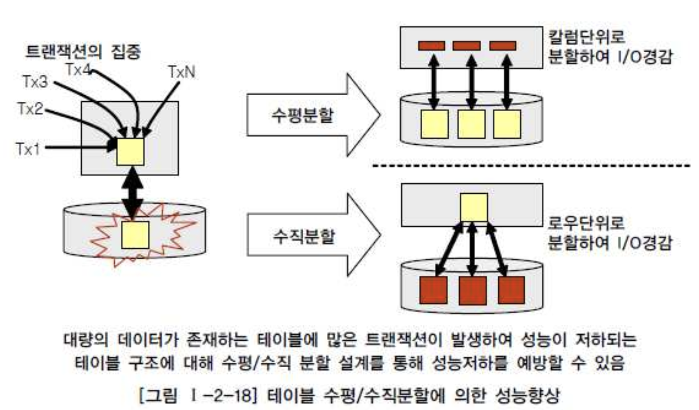

# 04. 대량 데이터에 따른 성능

##  1. 대량 데이터발생에 따른 테이블 분할 개요

###### 대량 데이터가 발생하는 테이블의 문제점

- 설계가 잘 되어 있는 데이터 모델이라도 대량의 데이터가 하나의 테이블에 집약되어 있고 하나의 하드웨어 공간에 저장되어 있으면 성능 저하를 피하기 힘들다.
- 인덱스도 또한 트리가 커지고 깊이가 깊어져, 조회성능에 영향을 미치게 된다.
- 입력/수정/삭제의 트랜잭션인 경우도 인덱스의 특성상 일량이 증가하여, 더많은 성능저하를 유발하게 된다.
- 컬럼이 많아지게 되면 물리적인 디스크의 여러 블록에 걸쳐 데이터가 저장되게 되며, 로우 길이가 너무 길어서 로우체이닝과 로우 마이그레이션이 많아지게 되어 성능이 저하된다.

## 2. 한 테이블에 많은 수의 칼럼을 가지고 있는 경우

- 200개의 컬럼을 가진 도서정보 테이블이 있다고 가정하고, 하나의 로우 길이가 10K이고 블록이 2K단위로 쪼개져 있으면, 로우는 대략 5개의 블록에 걸쳐 저장된다.
- 이렇게 여러블록에 컬럼이 흩어져 있다면, 디스크 I/O가 많이 일어나게 된다.
- 트랜잭션 발생시 어떤 컬럼에 대해 집중적으로 발생되는지 분석하여 테이블 분할을 하면 디스크 I/O가 감소하여 성능을 개선할 수 있다.

## 3. 대량 데이터 저장 및 처리로 인한 성능

- 대량 데이터가 예상될 경우, 파티셔닝 및 PK에 의해 테이블을 분할하는 방법을 적용할 수 있다.
- 오라클의 경우 LIST PARTITION, RANGE PARTITION, HASH PARTITION, COMPOSITE PARTITION 등이 가능하다.

##### 가.RANGE PARTITION 적용

- 요금정보처럼 항상 월단위로 데이터를 처리하는 특성을 가진 경우, PK인 요금일자의 년+월을 이용하여 12개의 파티션테이블을 만들어서 성능개선을 유도한다
- 가장 많이 사용하는 사용하며, 대상 테이블이 날짜 또는 숫자값으로 분리가 가능하고 각 영역별로 트랜잭션이 분리된다면 적용한다.
- 데이터보관주기에 따라 테이블에 데이터를 쉽게 지우는 것이 가능하므로(파티션테이블을 DROP) 테이블관리가 용이하다.

##### 나.LIST PARTITION 적용

- 지점, 사업소, 사업장, 핵심적인 코드 값 등으로 PK가 구성되어 있는 테이블이라면, 값 각각에 의해 파티셔닝이 되는 LIST PATITION을 적용할 수 있다.
- 특정값에 따라 분리저장할 수는 있으나, RANGE PARTITON과 같이 데이터 보관주기에 따라 쉽게 삭제하는 기능은 제공될 수 없다.

##### 다.HASH PARTITION 적용

- HASH조건에 따라 해시알고리즘이 적용되어 테이블이 분리되므로 설계자는 데이터가 어떤 테이블에 어떻게 들어갔는지 알 수 없다.
- HASH PARTITION도 보관주기에 따라 쉽게 삭제하는 기능은 제공 될 수 없다.

- 대용량이 되면 파티셔닝 적용은 필수적으로, 파티셔닝 기준을 나눌 수 있는 조건에 따라 적절한 파티셔닝 방법을 선택하여 성능을 향상 시키도록 한다.

## 4. 테이블에 대한 수평분할/수직분할의 절차

- 1) 데이터 모델링을 완성한다.
- 2) 데이터베이스 용량산정을 한다.
- 3) 대량 데이터가 처리되는 테이블에 대해서 트랜잭션 처리 패턴을 분석한다.
- 4) 컬럼 단위로 집중화된 처리가 발생하는지, 로우단위로 집중화된 처리가 발생되는지 분석하여 집중화된 단위로 테이블을 분리하는 것을 검토한다,

- 컬럼수가 너무 많은 경우는 테이블을 1:1형태로 분리할 수 있는지 검증하고, 컬럼수가 적지만 데이터 용량이 많아 성능저하가 예상되는 경우 테이블에 대해 파티셔닝 전략을 고려하도록 한다.