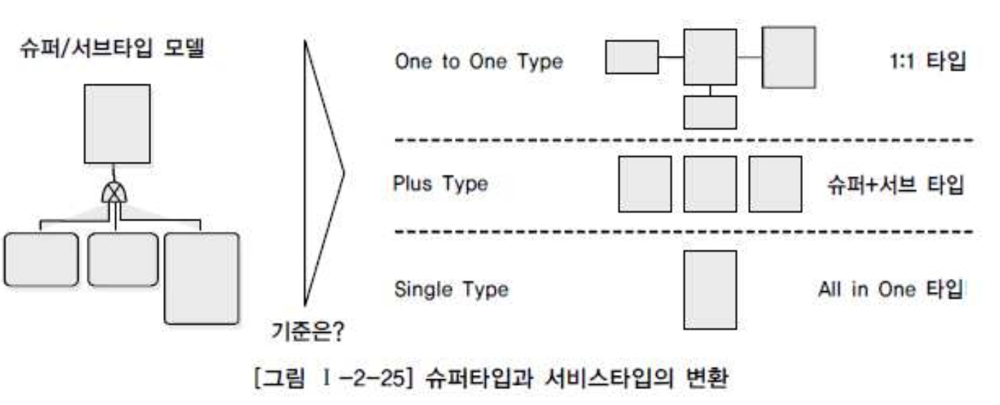
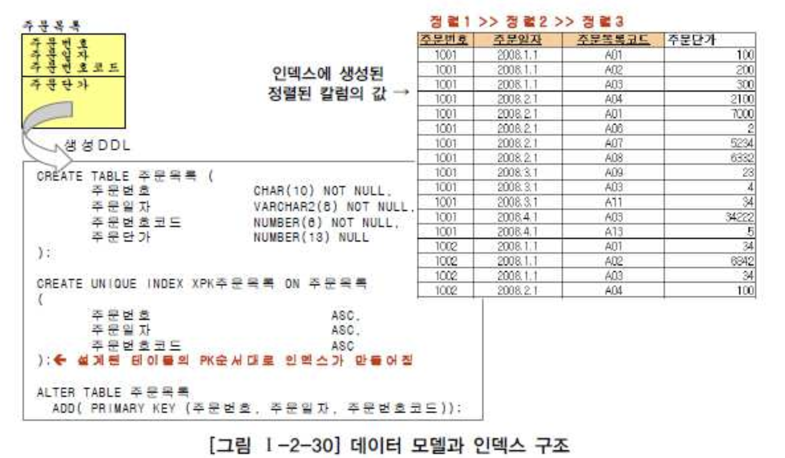
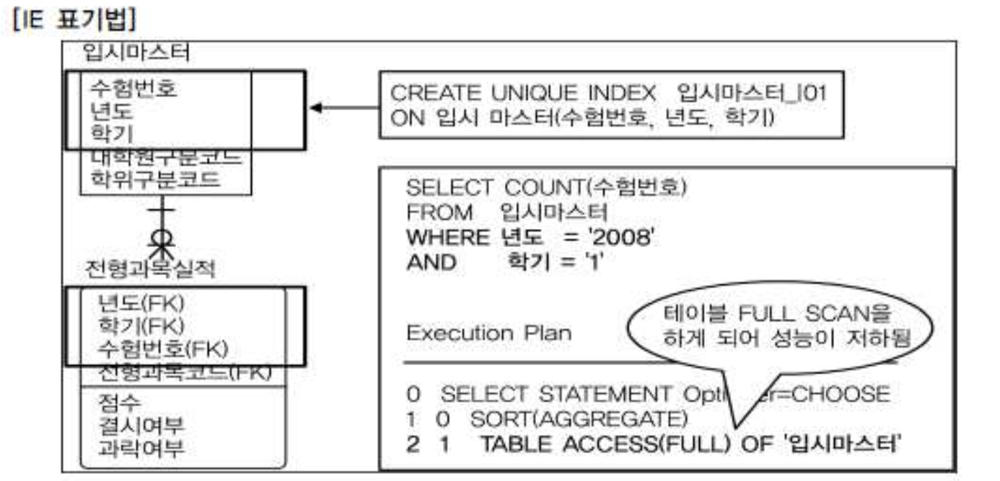
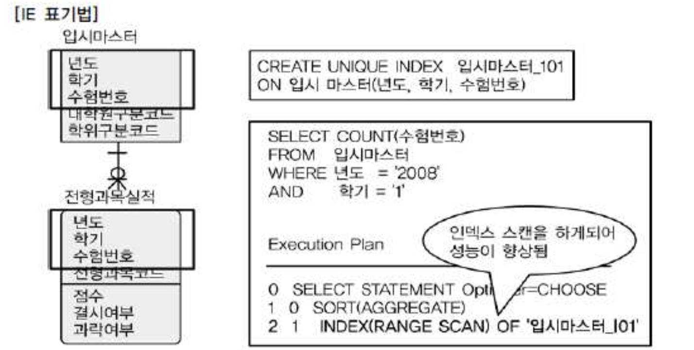
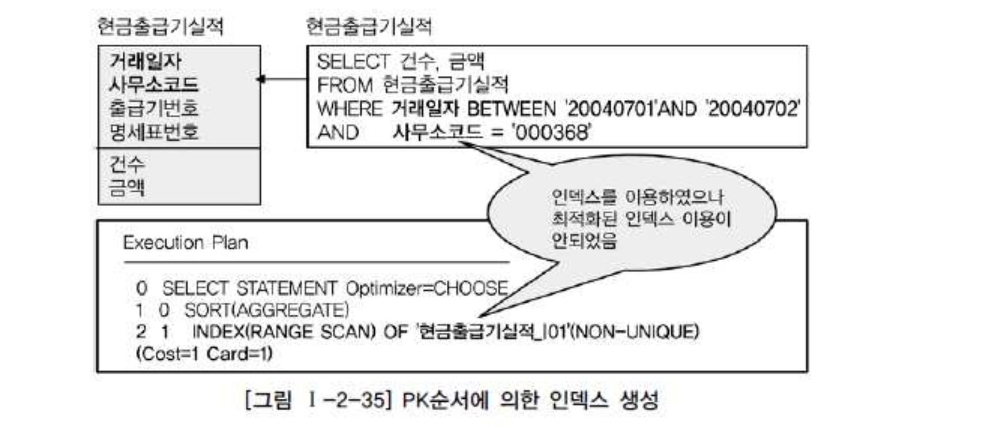

# 05. 데이터베이스 구조와 성능

## 1. 슈퍼타입/서브타입 모델의 성능고려 방법

#### 가. 슈퍼/서브타입 데이터 모델의 개요

- 슈퍼/서브타입 모델 업무를 구성하는 데이터의 특징을 공통과 차이점의 특징을 고려하여 효과적으로 표현할 수 있으므로, 자주 쓰이는 모델링의 방법이다.
- 이 모델은 논리데이터 모델에서 이용되는 형태이고, 물리적인 데이터 모델을 설계하는 단계에서는 일정한 기준에 의해 변환을 해야 한다.
- 아무런 기준없이 막연히 변환하는 것 자체가 성능 저하의 위험이 있다.

#### 나. 슈퍼/서브타입 데이터 모델의 변환

- 슈퍼/서브타입에 대한 변환을 잘못하면 성능이 저하되는 이유는 트랜잭션 특성을 고려하지 않고 테이블이 설계되었기 때문이다.

- 1) 트랜잭션은 항상 일괄로 처리하는데 테이블은 개별로 유지되어 Union연산에 의해 성능저하
- 2) 트랜잭션은 항상 서브타입 개별로 처리하는데 테이블은 하나로 통합되어 있어 불필요하게 많은 양의 데이터가 집약되어 성능저하
- 3) 트랜잭션은 항상 슈퍼+서브 타입을 공통으로 처리하는데 개별로 유지되어 있거나 하나의 테이블로 집약되어 있어 성능이 저하

- 데이터의 양이 소량일 경우 처리의 유연성을 고려해 1:1관계를 유지하는것이 바람직. 대용량일 경우는 트랜잭션의 발생형태에 따라 3가지 변환방법을 참조하여 상황에 맞게 변환하도록 해야 한다.

#### 다. 슈퍼/서브 타입 데이터 모델의 변환기술

- 1) 개별로 발생되는 트랜잭션에 대해서는 개별 테이블로 구성
- 2) 슈퍼타입+서브타입에 대해 발생되는 트랜잭션에 대해서는 슈퍼타입+서브타입 테이블로 구성
- 3) 전체를 하나로 묶어 트랜잭션이 발생할 때는 하나의 테이블로 구성

#### 라. 슈퍼/서브타입 데이터 모델의 변환타입 비교

| 구분                          | OneToOne Type                       | Plus Type                                      | Single Type                          |
| :---------------------------- | :---------------------------------- | :--------------------------------------------- | :----------------------------------- |
| 특징                          | 개별 테이블 유지                    | 슈퍼+서브타입 테이블                           | 하나의 테이블                        |
| 확장성                        | 우수함                              | 보통                                           | 나쁨                                 |
| 조인성능                      | 나쁨                                | 나쁨                                           | 우수함                               |
| I/O량 성능                    | 좋음                                | 좋음                                           | 나쁨                                 |
| 관리용이성                    | 좋지않음                            | 좋지않음                                       | 좋음(1개)                            |
| 트랜잭션 유형에 따른 선택방법 | 개별 테이블로 접근이 많은 경우 선택 | 슈퍼+서브 형식으로 데이터를 처리하는 경우 선택 | 전체를 일괄적으로 처리하는 경우 선택 |

## 2. 인덱스 특성을 고려한 PK/FK 데이터베이스 성능향상

#### 가. PK/FK 칼럼 순서와 성능개요

- 인덱스는 데이터를 접근할 때 경로를 제공하는 성능 측면에도 중요한 의미를 가지고 있기 때문에 설계단계 말에 컬럼의 순서를 조정할 필요가 있다.
- PK가 복합식별자인 경우, 앞쪽에 위치한 속성이 가급적 '=' 이거나 최소범위 'BETWEEN' '<>'가 들어와야 인덱스를 이용할 수 있다.
- 또한 FK라 하더라도, 인댁스를 생성하도록하고, 인덱스 컬럼의 순서도 조회조건을 고려하여 접근이 가장 효율적인 순서대로 생성한다.

#### 나. PK칼럼의 순서를 조정하지 않으면 성능이 저하이유

###### 데이터모델링에서 설계된 테이블의 PK순서대로 인덱스가 만들어진 경우

- 테이블에 접근하는 트랜잭션의 특징에 효율적이지 않은 인덱스가 생성되었으므로, 인덱스 범위를 넓게 이용하거나 Full Scan을 유발하게 된다.

#### 다. PK순서를 잘못 지정하여 성능이 저하된 경우 - 간단한 오류

- 입시마스터 테이블의 PK : 수험번호+년도+학기
- 입시마스터 테이블을 조회할 때 조회조건에 수험번호가 들어오지 않아 FULL TABLE SCAN이 발생됨
- 년도와 학기에 대한 내용이 빈번하게 들어오므로 PK순서를 변경함으로써 인덱스를 정상적으로 이용할 수 있게 한다.

#### 라. PK순서를 잘못 지정하여 성능이 저하된 경우 - 복잡한 오류

- 현금출급기실적의 PK는 거래일자+사무소코드+출급기번호+명세표번호로 구성
- 대부분의 SQL문장은 거래일자가 BETWEEN으로 들어오고 사무소코드가 '='로 들어와서 인덱스를 이용할 수 있으나 효율성이 떨어짐
- 인덱스 컬럼을 사무소코드+거래일자+출급기번호+명세표번호로 변경
- 테이블의 PK속성이 A+B와 B+A의 형태로도 빈번하게 조회되는 경우, 더 자주이용되는 형태로 PK순서를 구성하고, 순서를 바꾼 인덱스를 추가로 생성하는 것이 필요

## 3. 물리적인 테이블에 FK제약이 걸려있지 않을 경우 인덱스 미생성으로 성능저하

- 두 테이블사이에 FK참조 무결성 관계가 걸려있지 않더라도, 데이터 모델관계에 의해 상속받은 FK속성들은 조인조건으로 이용하는 경우가 많으므로, FK인덱스를 생성하는 것을 기본정책으로 하는 것이 좋다.
- FK인덱스 생성을 기본정책으로 하되 향후 트랜잭션에 의해 거의 활용되지 않았을 때만 지우는 것이 적절한 방법이 된다.