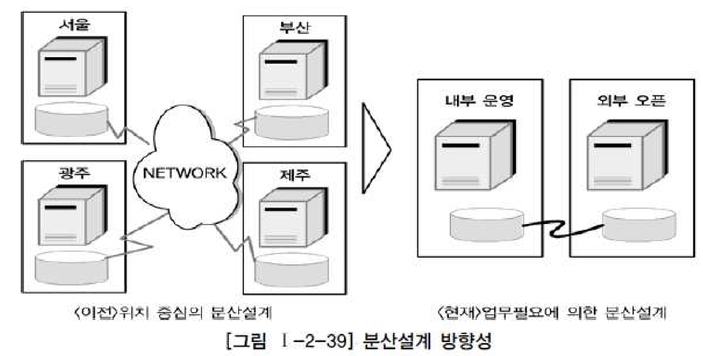
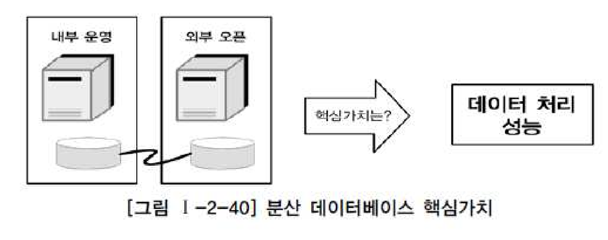
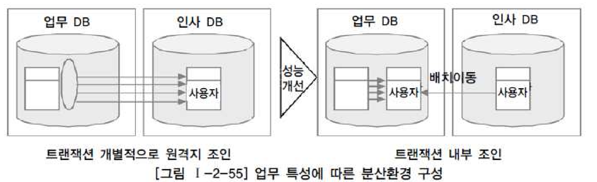

# 06. 분산데이터베이스와 성능

## 1) 분산 데이터베이스의 개요

- 여러 곳으로 분산되어있는 데이터베이스를 하나의 가상 시스템으로 사용할 수 있도록 한 데이터베이스
- 논리적으로 동일한 시스템에 속하나, 네트워크를 통해 물리적으로 분산되어 있는 데이터들의 모임
- 데이터베이스를 연결하는 빠른 네트워크환경을 이용하여 데이터베이스를 여러 지역 및 노드로 위치시켜 사용성/성능을 극대화시킨 데이터베이스

## 2) 분산 데이터베이스의 투명성(Transparency)

#### 분산데이터베이스가 되기 위해서는 6가지 투명성을 만족해야 한다.

1. 분할 투명성(단편화) : 하나의 논리적 Relation이 여러 단편으로 분할되어 각 단편의 사본이 여러 사이트에 저장
2. 위치 투명성 : 사용하려는 데이터의 저장장소를 명시가 필요하지 않음. 위치정보는 System Caltalog에 유지어야 함
3. 지역사상 투명성 : 지역DBMS와 물리적 DB사이의 Mapping 보장. 각 지역시스템 이름과 무관한 이름 사용가능
4. 중복 투명성 : DB객체가 여러 사이트에 중복되어 있는지 알 필요가 없는 성질
5. 장애 투명성 : 구성요소(DBMS, Computer)의 장애에 무관한 트랜잭션의 원자성유지
6. 병행 투명성 : 다수 트랜잭션 동시수행시 결과의 일관성 유지, TImm Stamp, 분산2단계 Locking을 이용하여 구현

- 위와 같은 특징을 모두 만족하며 구축하는 사례가 드물다.
- 최근에는 분산환경의 데이터베이스를 구축하기보다 통합하여 데이터베이스를 구축하는 사례가 더 많이 늘었음
- 그럼에도 업무적인 특징 및 지역적인 특징에 따라 적절히 활용하면, 다양한 장점을 가지고 있으므로, 대량데이터의 지역적/글로벌 처리등에서는 유용하게 활용되고 있음

## 3) 분산 데이터베이스의 적용방법 및 장단점

##### 가. 분산 데이터베이스 적용방법

- 우수한 성능으로 현장에서 가치있게 사용하는 방법은 업무의 흐름을 보고 업무구성에 따른 아키텍처 특징에 따라 데이터베이스를 구성하는 것이다.
- 단순히 분산환경에서 데이터베이스를 구축하는 것이 목적이 아니라. 업무의 특징에 따라 데이터베이스 분산구조를 선택적으로 설계하는 능력이 필요하다.
- 이러한 측면에서는 데이터베이스 분산설계라는 측면보다 데이터베이스 구조설계라는 의미로 이해해도 무방하다.

##### 나. 분산 데이터베이스 장단점

###### <장점>

- 지역 자치성, 점증적 시스템 용량 확장
- 신뢰성과 가용성
- 효용성과 융통성
- 빠른 응답속도와 통신비용 절감
- 데이터의 가용성과 신뢰성 증가
- 시스템 규모의 적절한 조절
- 각 지역 사용자의 요구 수용 증대

###### <단점>

- 소프트웨어 개발 비용
- 오류의 잠재성 증대
- 처리비용의 증대
- 설계,관리의 복잡성과 비용
- 불규칙한 응답 소고
- 통제의 어려움
- 데이터 무결성에 대한 위협

## 4) 분산 데이터베이스의 활용 방향성

- 업무적 특징에 따라 활용해야한다.

## 5) 데이터베이스 분산구성의 가치

- 통합된 데이터베이스에서 제공할 수 없는 빠른 성능을 제공하는것이 가능해진다.

## 6) 분산 데이터베이스의 적용기법

- 분산종류:테이블 위치분산, 테이블 분할분산, 테이블 복제분산, 테이블 요약분석전략이 있음
- 가장 많이 사용하는 방식은 테이블복제분산 방식이며, 성능이 저하되는 많은 데이터베이스에서 가장 유용하게 적용할 수 있는 기술적인 방법이다.
- 설계하는 방법은 일단 통합모델링을 하고, 각 테이블별로 업무적 특징에 따라 지역 또는 서버별로 테이블을 분산 또는 복제배치하는 형태로 설계할 수 있다.

##### 가. 테이블 위치분산

- 테이블의 구조는 변하지 않으며, 다른 데이터베이스에 중복되어 생성되지도 않는다.
- 다만, 설계된 테이블의 위치를 각각 다르게 위치시키는 것이다.

##### 나. 테이블 분할(Fragmentation) 분산

- 단순히 테이블의 위치만 다른 곳에 두는 것이 아니라, 각각의 테이블을 쪼개어 분산하는 방법이다.
- 수평분할, 수직분할이 있다.

###### 수평분할(Horizontal Fragmentation)

- 테이블을 특정 컬럼의 값을 기준으로 Row를 분리한다.
- 컬럼은 분리되지 않으며, 데이터를 한군데 집합시켜 놓아도 PK에 의해 중복발생이 일어나지 않음.
- 각 지사별로 사용하는 Row가 다를 때 이용한다.
- 각 지사에 존재하는 테이블에 대해 통합처리하는 경우 JOIN이 발생하여 성능저하가 예상되므로, 통합처리 프로세스가 많지 않은 경우에만 이용

###### 수직분할(Vertical Fragmentaion)

- 특정 컬럼값을 기준으로 컬럼을 분리한다.
- 컬럼을 기준으로 분할하였으므로 각각의 테이블에는 동일한 PK구조와 값을 가지고 있어야 한다.
- 예)제품의 재고량은 각 지사별로 관리하고, 단가는 본사에서 관리하는 경우
- 실제 프로젝트에는 이런 환경을 구성하는 사례는 드물다.

##### 다. 테이블 복제(Replication) 분산

- 동일한 테이블을 다른 지역이나 서버에 동시에 생성하여 관리하는 유형이다.

###### 부분복제(Segment Replication)

- 테이블의 일부내용만 다른 지역이나 서버에 위치시키는 방법
- EX) 본사 데이터베이스에는 테이블의 전체 내용이 들어가고, 각 지사 데이터베이스에는 각 지사별로 관계된 데이터만 들어가는 경우이다.
- 보통 지사에서 데이터가 먼저 발생되고 본사에는 지사데이터를 이용하여 통합하여 발생된다.
- 실제 프로젝트에서 많이 사용하는 분산기법에 해당됨
- 다른 지역간 데이터를 복제하는데는 많은 시간이 소요되므로, 야간배치작업을 통해 수행되며, 본사 지사 양쪽 데이터를 수정하여 전송하는 경우, 정합성을 일치시키는 것이 어렵기 때문에, 한쪽(지사)에서 데이터 수정이 발행하여, 본사로 복제하도록 한다.

###### 광역복제(Broadcast Replication)

- 테이블의 내용을 각 지역이나 서버에 위치시키는 방법
- 본사와 지사모두 동일한 정보를 가지고 있어 데이처처리에 특별한 제약을 받지 않는다.
- 실제 프로젝트에서 많이 사용하는 분산기법에 해당됨
- 본사에서 데이터가 입력,수정,삭제가 되어 지사에서 이용하는 형태이다.
- 부분복제와 마찬가지로 데이터를 복제하는데 많은 시간이 소요되고 많은 부하가 발생되므로 배치를 통해 복제가 되도록 한다,

##### 라. 테이블 요약(Summarization) 분산

- 테이블요약분산은 지역간 또는 서버간에 데이터가 비슷하지만 서로 다른 유형으로 존재하는 경우가 있다.

- 분석요약-동일한 테이블구조를 가지고 있으면서 분산되어 있는 동일한 내용의 데이터를 이용하여 통합된 데이터를 산출하는 방식
- 통합요약-분산되어 있는 다른 내용의 데이터를 이용하여 통합된 데이터를 산출하는 방식

###### <분석요약>

- 각 지사별로 존재하는 요약정보를 본사에서 통합하여 다시 전체에 대해서 요약정보를 산출하는 분산방법

###### <통합요약>

- 각 지사별로 존재하는 다른 내용의 정보를 본사에 통합하여 다시 전체에 대해서 요약정보를 산출하는 분산방법

## 7) 분산 데이터베이스를 적용하여 성능이 향상된 사례

###### <적용시 효과적인 경우>

- 성능이 중요한 사이트
- 공통코드, 기준정보, 마스터 데이터 등에 대해서 분산환경을 구성하면 성능이 좋아짐
- 실시간 동기화가 요구되지 않을 때, 거의 실시간(Near Real TIme)의 업무적인 특징을 가지고 있을때도 구성가능
- 특정 서버가 부하집중시 부하를 분산할 때
- 백업 사이트를 구성할 때 간단하게 분산기능을 적용하여 구성가능