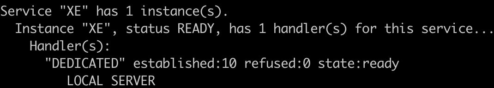
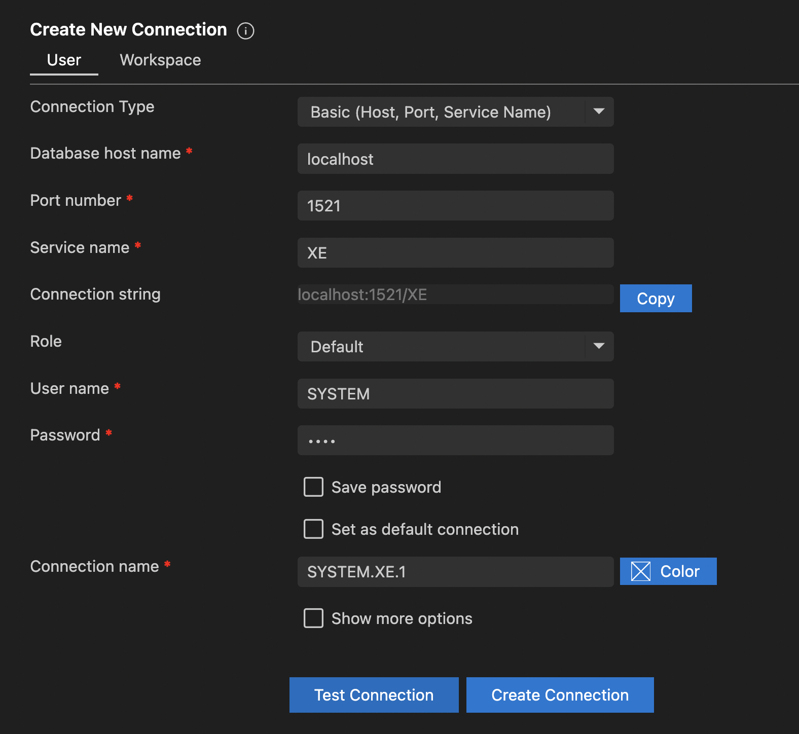

# oracle install

- m1환경에서 oracle server, client 설치


## server

오라클서버는 인텔칩에서만 설치가 가능하다.

colima는 m1칩에서도 오라클서버가 설치될 수 있도록 vm환경을 제공해준다.

```jsx
brew install colima
colima start --memory 4 --arch x86_64
colima status
```


### Docker Desktop을 colima로 변경

```jsx
docker context use colima # 도커 클라이언트를 변경.
```


### 접속오류 해결방법

- docker exec -it 8bd0f10287e2 sqlplus 를 통해서 접속은 되는데,
- 다른 앱에서 접근이 안되고 The Network Adapter could not establish the connection   등의 에러가 발생한다면
  아래 옵션으로 변경하고 colima, image를 재실행 해보자

https://logindev.github.io/posts/3000/

~~~sh
# 0 이 조회된다면
select dbms_xdb.gethttpport() from dual; 
# 아래 옵션을 삽입
exec dbms_xdb.sethttpport('8080');

colima stop
colima delete
colima start --memory 4 --arch x86_64
docker run --name oracle11g -e ORACLE_PASSWORD=pass -d -p 8080:8080 -p 1521:1521 jaspeen/oracle-xe-11g
~~~


### image pull, run

~~~
docker pull gvenzl/oracle-xe
docker run --name oracle -e ORACLE_PASSWORD="yourpass" -p 1521:1521 -d gvenzl/oracle-xe
docker logs -f oracle
~~~


### listener 확인

```sh
bash-4.4$ ㄷ
bash-4.4$ ls
listener.ora  sqlnet.ora  tnsnames.ora
bash-4.4$ cat listener.ora
LISTENER =
  (DESCRIPTION_LIST =
    (DESCRIPTION =
      (ADDRESS = (PROTOCOL = IPC)(KEY = EXTPROC_FOR_XE))
      (ADDRESS = (PROTOCOL = TCP)(HOST = 0.0.0.0)(PORT = 1521))
    )
  )

DEFAULT_SERVICE_LISTENER = XE # sid
```

listener 재적용 명령어

- listener에 우리가 사용할 sid 가 ready상태여야 접속이 가능하다.

```jsx
lsnrctl status # 리스너 떠 있는지 확인
lsnrctl reload
lsnrctl stop
lsnrctl start
lsnrctl services
```

- ready면 사용가능한 service 명
  - 위의 listener.ora에서 확인했던 XE instance가 사용가능하다.




## oracle client


### 1) sqlplus

~~~
접속1)
docker exec -it oracle sqlplus
system/pass 

접속2)
docker exec -it oracle bash
sqlplus system@localhost 
# password 작성select
department, sum(salary) as total
from employees
group by department
having total > 1000;
~~~

~~~sql
select instance from v$thread; # SID확인
select name,db_unique_name from v$database; # DB이름 확인
~~~


### 2) SQL Developer

[oracle 홈페이지](https://www.oracle.com/database/sqldeveloper/technologies/download/)에서 에서 다운로드 후 테스트.


### 3) Oracle Developer Tools for VS Code

- vscode에서 플러그인사용해서 사용가능





### 참고

[MacOS\] M1 맥북 도커로 ORACLE DB 실행하기](https://shanepark.tistory.com/400)

